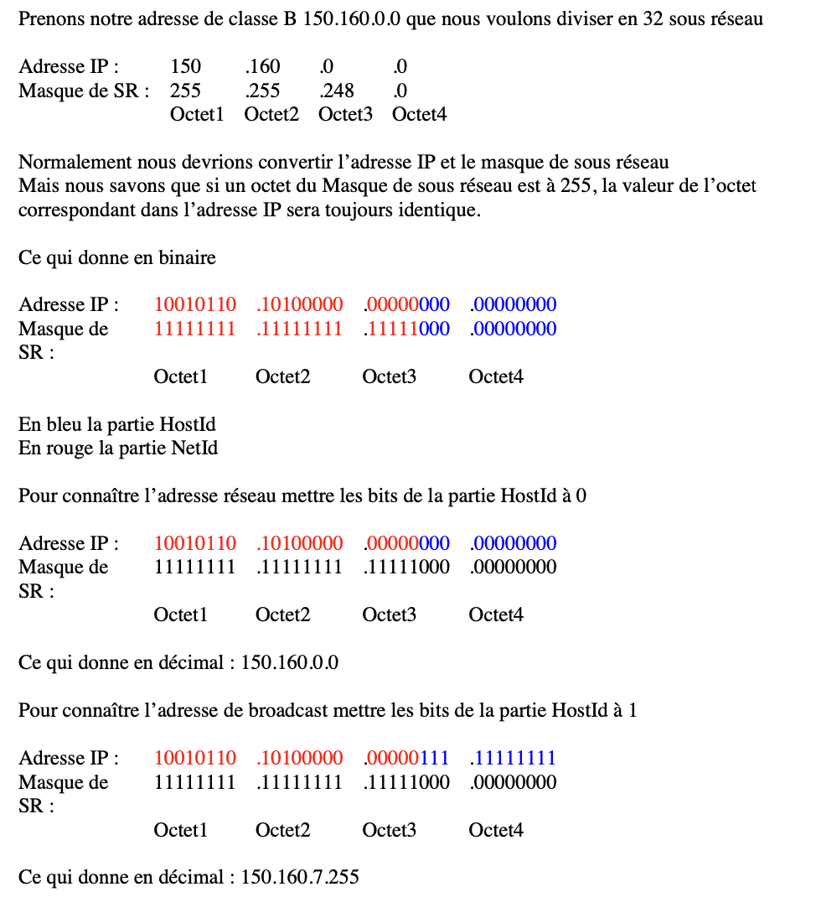
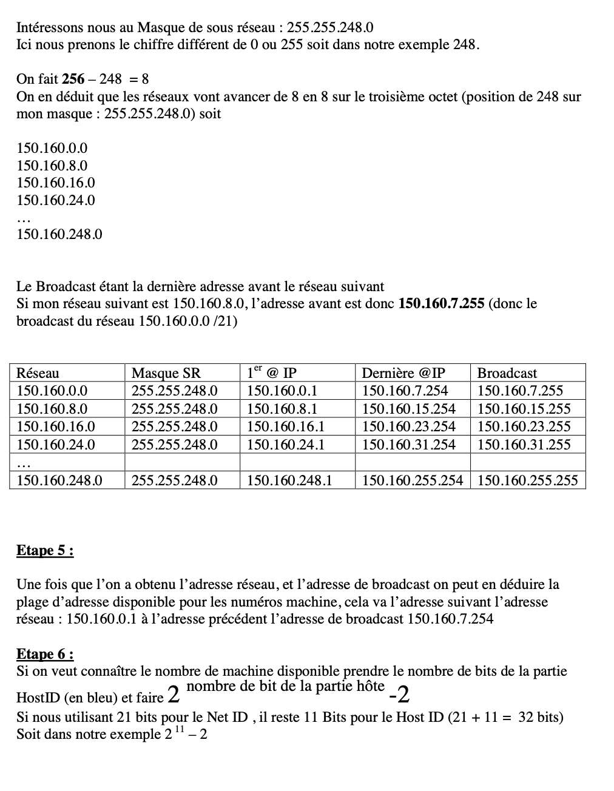

# Seance-8---PROCEDURE-POUR-CALCULER-SSREZ

 Etape 1 :
 ----------
Connaître la classe de l’adresse IP, pour définir son masque de sous réseau par défaut\
Si classe A : Masque de Sous réseau : 255.0.0.0 (ou /8 en Notation CIDR)\
Si classe B : Masque de Sous réseau : 255.255.0.0 (ou /16 en Notation CIDR)\
Si classe C : Masque de Sous réseau : 255.255.255.0 (ou /24 en Notation CIDR)  

Etape 2 :
-----------
Ajouter le nombre de bits nécessaires pour segmenter notre réseau en plusieurs sous réseau.\
Pour diviser notre réseau en 2 sous réseau, ajouter 1 bit\
Pour diviser notre réseau en 4 sous réseau, ajouter 2 bits\
Pour diviser notre réseau en 8 sous réseau, ajouter 3 bits\
Pour diviser notre réseau en 16 sous réseau, ajouter 4 bits\
Pour diviser notre réseau en 32 sous réseau, ajouter 5 bits\
Pour diviser notre réseau en 64 sous réseau, ajouter 6 bits\
Pour diviser notre réseau en 128 sous réseau, ajouter 7 bits\
Pour diviser notre réseau en 256 sous réseau, ajouter 8 bits\
Pour diviser notre réseau en 512 sous réseau, ajouter 9 bits\
Pour diviser notre réseau en 1024 sous réseau, ajouter 10 bits .....  

Attention le nombre de bits de notre masque sous réseau par défaut (/8 pour Classe A ; /16 pour Classe B ; /24 pour Classe C) + le nombre de bits à ajouter pour segmenter le réseau ne devra jamais dépasser un /30  

Exemple : pour une adresse de classe C le masque de sous réseau par défaut est en /24 , par contre je ne pourrai jamais diviser ce réseau de Classe C en 128 sous réseau car pour cela j’aurai besoin de 7 Bits , et 24 + 7 = 31 donc impossible car supérieur à /30  

Etape 3 :
---------
Ecrire notre nouveau masque de sous réseau :  
Exemple je veux diviser en 32 sous réseau une adresse de classe B : 150.160.0.0  
Le masque de sous réseau normal d’une classe B est /16  
Pour diviser une réseau en 32 sous réseau j’ai besoin 5 bits supplémentaire  
Donc 16 + 5 = 21 bits  
Ce qui nous donne en notation binaire : 11111111.11111111.11111000.00000000  
Ou en décimal : 255.255.248.0  
Ou en notation CIDR : 150.160.0.0/21  
   
Etape 4 :
---------
**A partir de cette étape, on ne modifie plus le masque de sous réseaux !!!   
On ne doit travailler que sur l’adresse IP, le masque de sous réseau nous servira juste  
pour différencier la partie réseau (netId) et la partie hôte (hostId)   
de notre adresse IP**   

 
 

Etape 4 (Méthode B):
--------------------
Vous pouvez aussi trouver l’étendue sans passer par le binaire.  
Si nous reprenons 150.160.0.0 &nbsp; &nbsp; 255.255.248.0  

